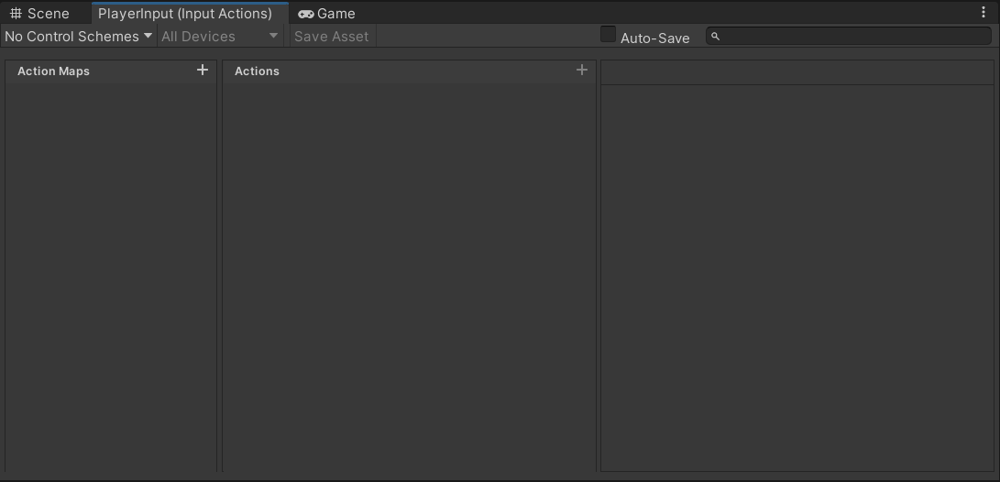

## FPS_Offical_Demo

## Development Day 1: 2023.12.11

1. `InputSystem`：在`Unity->Window->Package Manager->Unity Registry->Input System`当中，相较于旧版的`InputManager`，`InputSystem`的操作虽然更为繁琐复杂，但应对跨平台项目时面对不同的输入方式`InputSystem`的输入映射机制则为开发者们提供了巨大的便捷。同时，它提供了一些非常好的功能便于我们去创建一个更为专业的控制系统。

​		

2. 